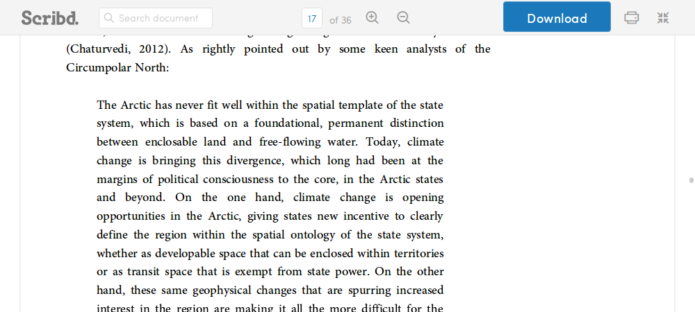
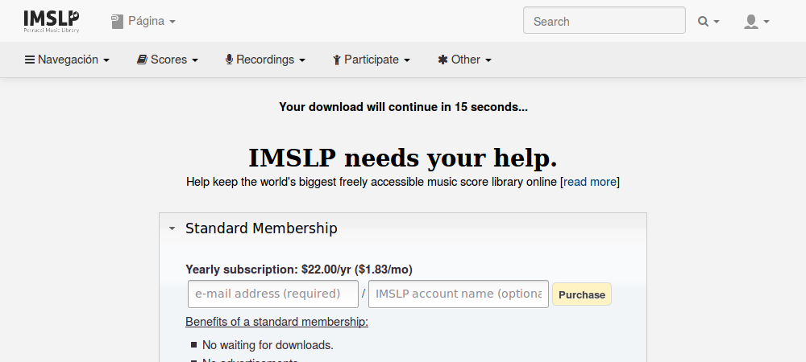

# User scripts for web browsers

This repository hosts the userscripts I'll be writting. These are little pieces of software that extend or modify the behavior or appearance of certain web pages. They need to be used with a user script manager, which is an add-on or extension for web browsers (check the [installation section](#installation)).

This README file has been borrowed from [@soyguijarro](https://github.com/soyguijarro/). Check out his cool [userscripts](https://github.com/soyguijarro/userscripts)!

## List of userscripts

### [DLE](http://dle.rae.es/) (former DRAE)

#### DLE (former DRAE) Clean UI

Injects some CSS to adjust sizes or remove visual elements to RAE's online Spanish dictionary. Having a cleaner and less distraction-prone design makes you focus on real content.  
Responsive design has been taken into account, but may present casual disarrangements. Please fill an [issue](https://gitlab.com/Roboe/userscripts/issues) if you experiment trouble.

#### DLE (former DRAE) Expand Abbreviations

Injects some CSS to expand abbreviations and show full terms. Abbreviations are proper of paper dictionaries, and have no sense in digital content. Not having to decrypt random things makes definitions clearer.

### [Scribd](https://www.scribd.com/) Document Preview Unblocker

Injects some CSS to unblock the clumsy protection Scribd puts for documents in their website. Choose whether you want to join their private garden paying for content uploaded by volunteers or just read the previews that are already being downloaded to your browser.

### [IMSLP](https://imslp.org/) Subscription Page Skipper

Redirects you to the requested download without waiting for 15 seconds. You can still visit the [subscription page](https://imslp.org/wiki/IMSLP:Subscriptions) to support the IMSLP project economically or explore [other ways to contribute](https://imslp.org/wiki/IMSLP:Contributor_Portal) (most of them don't require money!).

## Installation

1. If you don't have a user script manager, install one first. For Mozilla Firefox, get [Greasemonkey](https://addons.mozilla.org/firefox/addon/greasemonkey/). For Google Chrome/ium, [Tampermonkey](https://chrome.google.com/webstore/detail/tampermonkey/dhdgffkkebhmkfjojejmpbldmpobfkfo) is the one you need. For other browsers, check [this page](http://wiki.greasespot.net/Cross-browser_userscripting).

2. In this page, click on the filename of the script you want to install (they end in `.user.js`). A new page will load showing its code. Click on the **Raw** button.

3. Your user script manager will prompt you to confirm the installation.

## Compatibility

These scripts have been tested with [Greasemonkey](https://addons.mozilla.org/firefox/addon/greasemonkey/) on Mozilla Firefox and [Tampermonkey](https://chrome.google.com/webstore/detail/tampermonkey/dhdgffkkebhmkfjojejmpbldmpobfkfo) on Google Chrome/ium, but they should work with pretty much any user script manager. If you find something not working properly, please [report the issue](https://gitlab.com/Roboe/userscripts/issues).

## License

These scripts are released under version 3 of the GNU General Public License (GPL v3). The full text of the license is available in the [LICENSE file](LICENSE).
