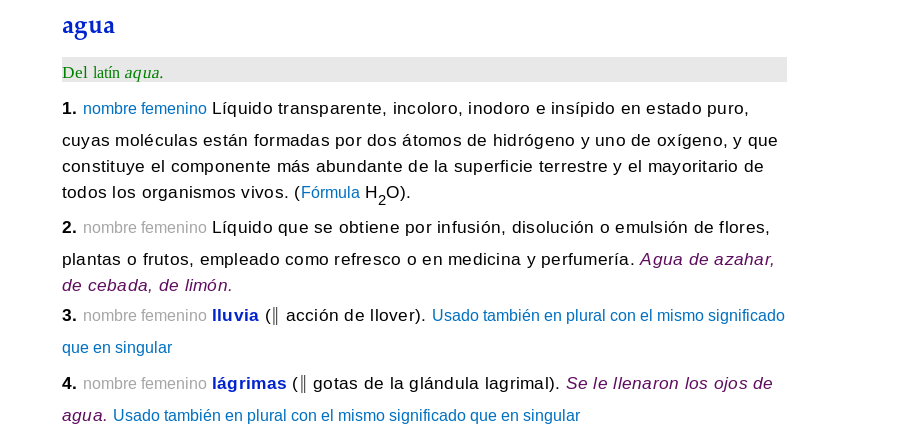

# Extensions and userscripts for web browsers

This repository hosts the webextensions and userscripts I'll be writting. These are little pieces of software that extend or modify the behavior or appearance of certain web pages.

WebExtensions can be installed right away through a central repository (like [AMO](https://addons.mozilla.org) for Firefox). On the contrary, userscripts need an userscript manager, which is an add-on or extension for web browsers (check the [installation section](#userscripts-installation)).

#### Call for collaboration

Extension developers are encouraged and allowed by the [license](#license) to publish these extensions in whatever extension repository they want. Don't forget to [contact me](https://gitlab.com/Roboe/userscripts/issues) for adding download links here and to receive my gratitude!

#### Acknowledgements

This README file was initially borrowed from [@soyguijarro](https://github.com/soyguijarro/). Check out his cool [userscripts](https://github.com/soyguijarro/userscripts)!

## List of extensions and userscripts

### [Diccionario de la Lengua Española](http://dle.rae.es/) (DLE, former DRAE)

#### DLE (former DRAE) Clean UI

Injects some CSS to adjust sizes or remove visual elements to RAE's online Spanish dictionary. Having a cleaner and less distraction-prone design makes you focus on real content.  
Responsive design has been taken into account, but may present casual disarrangements. Please fill an [issue](https://gitlab.com/Roboe/userscripts/issues) if you experiment trouble.

Firefox WebExtension | Userscript
-------------------- | ----------
[Install from AMO](https://addons.mozilla.org/firefox/addon/dle-clean-ui/) | [Install (open raw)](DLE_Clean_UI.user.js)

#### DLE (former DRAE) Expand Abbreviations

Injects some CSS to expand abbreviations and show full terms. Abbreviations are proper of paper dictionaries, and have no sense in digital content. Not having to decrypt random things makes definitions clearer.

Firefox WebExtension | Userscript
-------------------- | ----------
[Install from AMO](https://addons.mozilla.org/firefox/addon/dle-expand-abbreviations/) | [Install (open raw)](DLE_Expand_Abbreviations.user.js)

### [Scribd](https://www.scribd.com/) Document Preview Unblocker

Injects some CSS to unblock the clumsy protection Scribd puts for documents in their website. Choose whether you want to join their private garden paying for content uploaded by volunteers or just read the previews that are already being downloaded to your browser.

Firefox WebExtension | Userscript
-------------------- | ----------
Unsupported          | [Install (open raw)](IMSLP_Subscription_Page_Skipper.user.js)

### [IMSLP](https://imslp.org/) Subscription Page Skipper

Redirects you to the requested download without waiting for 15 seconds. You can still visit the [subscription page](https://imslp.org/wiki/IMSLP:Subscriptions) to support the IMSLP project economically or explore [other ways to contribute](https://imslp.org/wiki/IMSLP:Contributor_Portal) (most of them don't require money!).

Firefox WebExtension | Userscript
-------------------- | ----------
[Install from AMO](https://addons.mozilla.org/firefox/addon/imslp-subscription-skipper/) | [Install (open raw)](IMSLP_Subscription_Page_Skipper.user.js)

## Fix Dark Theme Input Boxes

When you are using a dark theme for the OS shell &mdash;like Adwaita-dark on a [GNU/Linux distro](https://www.getgnulinux.org/en/linux/) with the [GNOME desktop](https://www.gnome.org/)&mdash;, inputs, selectors and buttons background and text colors are inherited from the dark theme, which causes some texts to be illegible. This extension restores the default background and text colors to inputs, selects and buttons to fix this.

Firefox WebExtension | Userscript
-------------------- | ----------
[Install from AMO](https://addons.mozilla.org/firefox/addon/fix-dark-theme-input-boxes/) | Unsupported

## Userscripts installation

1. If you don't have a user script manager, install one first. For Mozilla Firefox, get [Greasemonkey](https://addons.mozilla.org/firefox/addon/greasemonkey/). For Google Chrome/ium, [Tampermonkey](https://chrome.google.com/webstore/detail/tampermonkey/dhdgffkkebhmkfjojejmpbldmpobfkfo) is the one you need. For other browsers, check [this page](http://wiki.greasespot.net/Cross-browser_userscripting).

2. In this page, click on the filename of the script you want to install (they end in `.user.js`). A new page will load showing its code. Click on the **Raw** button.

3. Your user script manager will prompt you to confirm the installation.

## Compatibility

### WebExtensions

WebExtensions are cross-browser, but need to be published on every browser-specific repository to make the dream come true.

I'll be building WebExtensions for my daily browser, Mozilla Firefox. Users of other browsers can go with the fully-supported userscript counterparts, or read the [above paragraph](#call-for-collaboration).

### Userscripts

These scripts have been tested with [Greasemonkey](https://addons.mozilla.org/firefox/addon/greasemonkey/) on Mozilla Firefox, but they should work with pretty much any user script manager. If you find something not working properly, please [report the issue](https://gitlab.com/Roboe/userscripts/issues).

## License

These webextensions and scripts are released either under version 3 of the [GNU General Public License v3.0](https://www.gnu.org/licenses/gpl-3.0.en.html) (GPLv3) or the [Unlicense](https://unlicense.org/). The full text of the license is available in the [LICENSE file](LICENSE). Besides, each webextension has a copy of the license file bundled in their folder.
