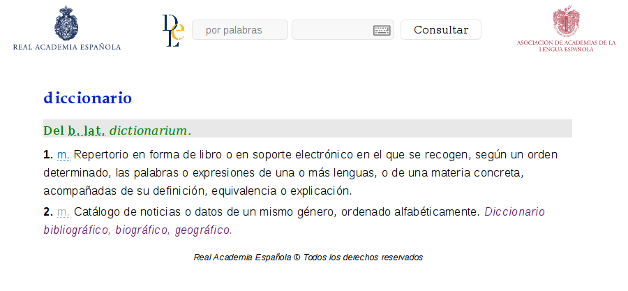

# Interfaz simplificada para el DLE (antes DRAE)

Ajusta y oculta elementos en la web del Diccionario de la Lengua Española (antes diccionario de la RAE) para una experiencia de diccionario sin distracciones.

Esta extensión ajusta o elimina elementos visuales del Diccionario de la Lengua Española en línea, publicado por la Real Academia Española (RAE).

Un diseño limpio y con menos contenido propenso a distraer facilita la concentración y dirige la atención al contenido principal.

La vista de móvil y pantallas pequeñas también se ha tenido en cuenta, pero puede presentar pequeños desbarajustes. Por favor, contacta por correo o en el sitio de asistencia listados a la derecha si encuentras algún problema y lo solucionaré a la mayor brevedad.

Esta extensión es [software libre](https://www.gnu.org/philosophy/free-sw.es.html) (licencia GPLv3). Puede consultarse en GitLab [el código fuente de la extensión](https://gitlab.com/Roboe/userscripts/tree/master/dle-clean-ui).

Instalar | Enlace
-------- | ------
WebExtension para Firefox | https://addons.mozilla.org/firefox/addon/dle-clean-ui/
Userscript | [Pulsar en Open RAW](../DLE_Clean_UI.user.js)
