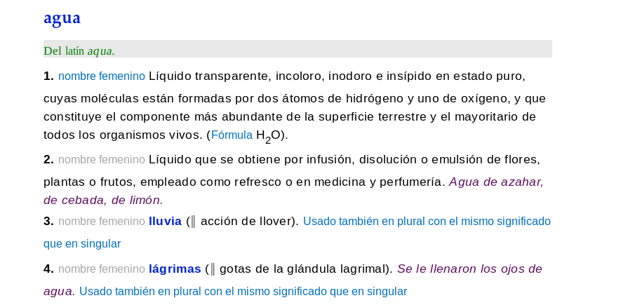

# Expandir abreviaturas del DLE (antes DRAE)

Reemplaza las abreviaturas de las acepciones del Diccionario de la Lengua Española (antes diccionario de la RAE) con su término completo.

Esta extensión expande las abreviaturas utilizadas en el Diccionario de la Lengua Española en línea, publicado por la Real Academia Española (RAE), y muestra los términos y comentarios completos.

Las abreviaturas son propias de los diccionarios en papel y tienen sentido en menos ocasiones para el contenido digital. Las definiciones quedan más explícitas cuando no se tienen que descifrar letras y siglas enrevesadas.

Enlaces a las definiciones de las imágenes, para comparar: [«agua» en la versión normal del DLE](http://dle.rae.es/?id=1BKpQj3); [«agua» en la versión ligera del DLE](http://dle.rae.es/srv/fetch?id=1BKpQj3).

Esta extensión es [software libre](https://www.gnu.org/philosophy/free-sw.es.html) (licencia GPLv3). Puede consultarse en GitLab [el código fuente de la extensión](https://gitlab.com/Roboe/userscripts/tree/master/dle-expand-abbreviations).

Instalar | Enlace
-------- | ------
WebExtension para Firefox | https://addons.mozilla.org/firefox/addon/dle-expand-abbreviations/
Userscript | [Pulsar en Open RAW](../DLE_Expand_Abbreviations.user.js)
