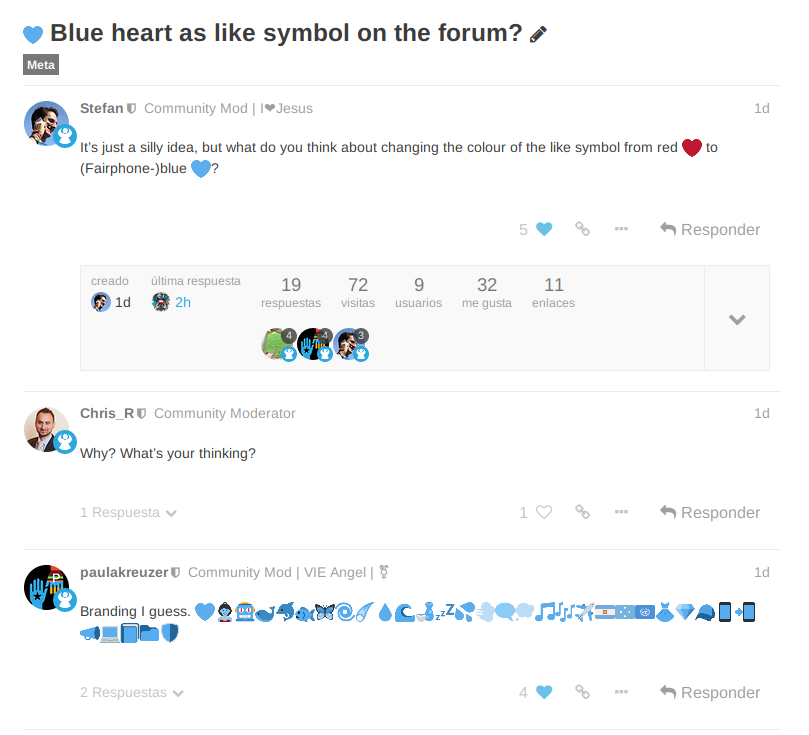

# Fairphone Heart

Replaces the red 'like' for a bluish one in the Fairphone Forum.

An experimental extension to test the viability of replacing the red 'like' for a bluish, more appropiate one in the Fairphone Forum.

Follow the discussion in the dedicated forum thread: https://forum.fairphone.com/t/blue-heart-as-like-symbol-on-the-forum/42629/

Install | Link
------- | ----
WebExtension for Firefox | https://addons.mozilla.org/firefox/addon/fairphone-blue-heart/
Userscript | Unsupported
