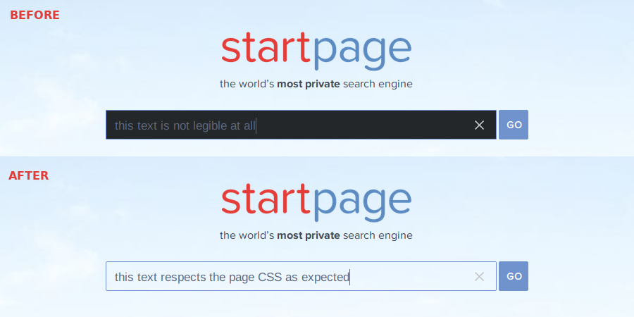

# Fix Dark Theme Input Boxes

Sets default background and text colors to inputs, selects and buttons when using a dark theme for the OS shell.

When you are using a dark theme for the OS shell —like Adwaita-dark on a [GNU/Linux distro](https://www.getgnulinux.org/en/linux/) with the [GNOME desktop](https://www.gnome.org/)—, the background and text colors of inputs, selectors and buttons are inherited from the dark theme, which causes some texts to be illegible. This extension restores the default background and text colors to inputs, selects and buttons to fix this issue.

This extension is [libre software](https://www.gnu.org/philosophy/free-sw.en.html) (under the Unlicense license). You can check in GitLab [the source code of the extension](https://gitlab.com/Roboe/userscripts/tree/master/fix-dark-theme-input-boxes/).

Install | Link
------- | ----
WebExtension for Firefox | https://addons.mozilla.org/firefox/addon/fix-dark-theme-input-boxes/
Userscript | Unsupported
