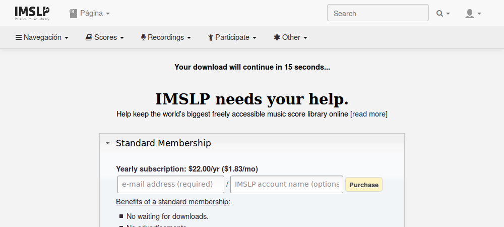

# Omitir la página de suscripción de IMSLP

Evita esperar 15 segundos cuando descargues partituras de IMSLP. 
Puedes visitar la página de suscripción para consultar diferentes maneras de mantener con vida el proyecto.

Esta extensión omite de manera automática la página de suscripción del [International Music Score Library Project](http://imslp.org/) (IMSLP). Cuando pulsas para descargar una partitura, te redirige directamente a la descarga, evitándote esperar 15 segundos.

Incluso con esto, aún puedes visitar [la página de suscripción](https://imslp.org/wiki/IMSLP:Subscriptions) para colaborar con el proyecto económicamente o [explorar otras maneras de contribuir](https://imslp.org/wiki/IMSLP:Contributor_Portal); para la mayoría de ellos no se necesita dinero, ;)

Esta extensión es [software libre](https://www.gnu.org/philosophy/free-sw.es.html) (licencia GPLv3). Puede consultarse en GitLab [el código fuente de la extensión](https://gitlab.com/Roboe/userscripts/tree/master/imslp-subscription-skipper).

Instalar | Enlace
-------- | ------
WebExtension para Firefox | https://addons.mozilla.org/firefox/addon/imslp-subscription-skipper/
Userscript | [Pulsar en Open RAW](../IMSLP_Subscription_Page_Skipper.user.js)
